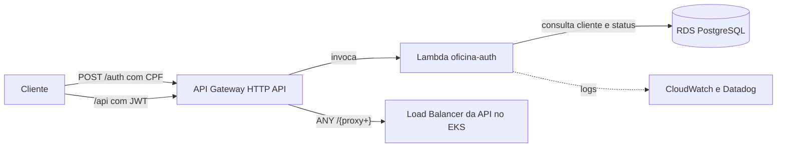

# fiap_tech_challenge_oficina_auth_lambda

Lambda de autenticação dos clientes por CPF e o API Gateway, porta de entrada de todo o sistema. Faz parte do Tech Challenge Fase 3:

| Repositório | Responsabilidade |
|---|---|
| [fiap_tech_challenge_oficina_api](https://github.com/gabrielov2003/fiap_tech_challenge_oficina_api) | Aplicação principal, no EKS |
| fiap_tech_challenge_oficina_auth_lambda | Este repositório. Autenticação por CPF e API Gateway |
| [fiap_tech_challenge_oficina_infra_k8s](https://github.com/gabrielov2003/fiap_tech_challenge_oficina_infra_k8s) | Rede, cluster EKS, segredos e Datadog |
| [fiap_tech_challenge_oficina_infra_database](https://github.com/gabrielov2003/fiap_tech_challenge_oficina_infra_database) | Banco de dados RDS PostgreSQL |

## Arquitetura



## Como funciona

`POST /auth` com `{"cpf": "..."}`:

1. Valida o formato e os dígitos do CPF.
2. Busca o cliente no schema do ambiente (`dev` ou `prod`) e confere se está `ativo`.
3. Devolve um JWT HS256 assinado com a mesma chave que a API usa para validar.

| Status | Quando |
|---|---|
| `200` | Cliente ativo. Devolve `access_token`, `token_type` e `expires_in` |
| `400` | CPF inválido |
| `403` | Cliente inativo |
| `404` | Cliente não encontrado |

O token leva `sub` (id do cliente), `role` `cliente`, `cpf`, validade de 1 hora e os campos que o Flask-JWT-Extended da API espera (`jti`, `type` e `fresh`). Os logs são JSON com o `correlation_id`, que é o requestId do gateway e volta no header `X-Correlation-ID`. O CPF nunca vai para os logs.

```bash
curl -X POST https://<gateway>/auth -H "Content-Type: application/json" -d '{"cpf": "11144477735"}'
curl https://<gateway>/api/os -H "Authorization: Bearer <access_token>"
```

## API Gateway

Um HTTP API por ambiente (`oficina-gateway-dev` e `oficina-gateway-prod`), no stage `$default`:

| Rota | Destino |
|---|---|
| `POST /auth` | Esta Lambda |
| `ANY /{proxy+}` | LoadBalancer da API, com `X-Correlation-ID` igual ao requestId |

Throttling de 50 requisições por segundo com rajada de 100, e access logs JSON no CloudWatch. A URL fica no output `gateway_url` e em `/oficina/<env>/gateway_url` no SSM. O Swagger da API fica em `<URL do gateway>/apidocs/`.

## Integração com os outros repositórios

| Parâmetro no SSM | Criado por | Uso |
|---|---|---|
| `/oficina/network/vpc_id` e `/oficina/network/private_subnet_ids` | infra_k8s | A Lambda roda nas subnets privadas, junto do RDS |
| `/oficina/db/*` | infra_database | Conexão com o banco |
| `/oficina/<env>/jwt_secret` | infra_k8s | Assinatura dos tokens |
| `/oficina/<env>/api_url` | pipeline da API | Destino da rota `ANY /{proxy+}` |

## Testes e execução local

```bash
python -m pip install -r requirements.txt -r requirements-dev.txt
python -m pytest tests/ -v
```

Os testes cobrem CPF inválido, corpo inválido, cliente não encontrado e inativo, claims do token, correlation id e corpo em base64.

Para rodar a função no emulador da AWS, copie `.env.example` para `.env`. Com a API local no Docker Compose, use `DB_HOST=host.docker.internal`:

```bash
docker build --target base -t oficina-auth .
docker run --rm -p 9000:8080 --env-file .env oficina-auth
curl -X POST "http://localhost:9000/2015-03-31/functions/function/invocations" -d '{"body": "{\"cpf\": \"11144477735\"}"}'
```

## Terraform

Fica em `terraform/` e usa a variável `env` (`dev` ou `prod`) para nomear os recursos: ECR da imagem, IAM role, security group, Lambda em imagem de container dentro da VPC, HTTP API com rotas, stage e access logs, log groups com 7 dias de retenção e o parâmetro com a URL do gateway. O estado de cada ambiente fica em `auth-lambda/<env>.tfstate`.

## CI/CD

| Branch | Ambiente | Recursos |
|---|---|---|
| `dev` | dev | `oficina-auth-dev` e `oficina-gateway-dev` |
| `main` | prod | `oficina-auth-prod` e `oficina-gateway-prod` |

| Job | Quando roda | O que faz |
|---|---|---|
| `test` | Pull requests e pushes em `dev` e `main` | Testes, `terraform fmt` e `terraform validate` |
| `deploy` | Push em `dev` ou `main` | Build da imagem (com a extensão do Datadog se houver API key), push no ECR e `terraform apply` do ambiente |

Secrets: `AWS_ACCESS_KEY_ID`, `AWS_SECRET_ACCESS_KEY` e, opcional, `DD_API_KEY`. Variáveis: `TF_STATE_BUCKET` e, opcionais, `AWS_REGION` e `DD_SITE`.

Este repositório é o último no primeiro deploy. Se subir antes da API, o gateway fica só com `POST /auth` até o próximo deploy.

## Documentação

RFCs, ADRs, diagramas e roteiro do vídeo: [documentacao_fase3](https://github.com/gabrielov2003/TechChallenge1/tree/main/documentacao_fase3).

---
Este projeto faz parte do Tech Challenge da Pós Graduação em Arquitetura de Software da FIAP.
